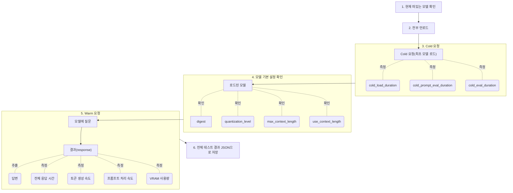

# 2026-09-15 TIL

## 오늘 한 것
- 팀원들이 선택한 모델들의 모델카드 정보를 수집하고 정리했다.
- 나와 희재님의 모델은 사실상 선택한 이후에 큰 변화가 없었기 때문에 큰 문제 없이 수집할 수 있었지만 정수님 같은 경우에는 이상하게도 그래픽카드 이상으로 모델들이 제대로 구동되지 않는 문제가 발생하여 계속 변경하셔야 했다.
- 그러나 다행히도 문제를 해결하는 방법을 알아내셔서 고정해가지고 모델 카드 및 기타 정보를 전부 작성할 수 있었다.
- 또한 성능 지표에 대해서도 정리를 해두었다.
- 소스 코드나 레포지토리의 README에 적어두기는 했지만 매번 찾아갈 수는 없기 때문에 팀 공유 노션에 따로 정리를 해두었다.
- 프로젝트의 로직 플로우 차트를 작성했다.
- `01_model_test.py`는 기본적으로 이번 프로젝트에 있어서 베이스라인이 될 수 있게끔 설계한 파일이기 때문에 어떤 흐름으로 진행되는 것인지 한 눈에 파악할 수 있도록 mermaid로 간단하게 표현해두었다.

## 왜 중요한가
- 모델들의 정보들은 프로젝트에서 정리하기를 요구하는 기본사항이기 때문이기도 하며, 이렇게 하나하나 찾아가다보니 어떤 정보를 어디에서 얻어야 하는지 익숙해질 수 있다.
- 성능 지표를 문서화하는 것은 편의성과 관리의 용이성을 늘릴 수 있다.
- 소스 코드의 로직을 플로우 차트로 표현하는 것은 소스 코드 없이 프로젝트의 전체 플로우가 어떤 식으로 흐르는지 파악할 수 있는 재료이기 때문에 중요한 요소이다.

## 코드/예시

## 헷갈렸던 부분 & 해결
- 어제 대부분의 것들을 미리 준비해둿었기 때문에 크게 어려운 부분은 없었다.

## 내일 더 파볼 것
- 내일은 희재님이 만들어줄 테스트 파일을 이용해서 실측을 진행해볼 예정이다.