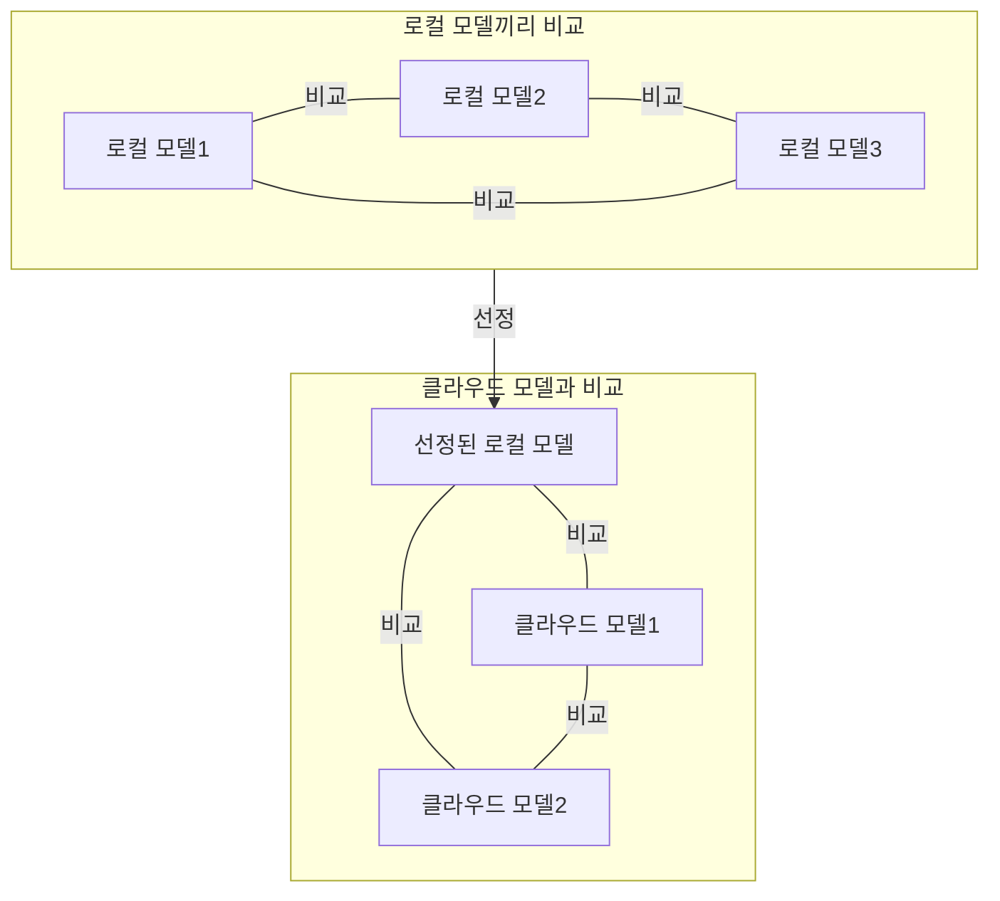

# 2026-09-17 TIL

## 오늘 한 것
- 클라우드 LLM모델에서 실험한 결과와 로컬 모델들 중에서 선정된 모델인 kanana와 비교하고 분석한 보고서를 작성하였다.
  - 흥미롭게도 motif3가 kanana와 같은 정성 평가 점수를 받았고, 속도 면에서는 아주 큰 차이가 있지는 않았다.
  - 로컬과 클라우드라는 특성 때문에 실제로 서로 비교할 수 있는 지표가 많지는 않았다.
  - 하지만 비교 가능한건 확실히 비교하고 나머지는 서로 명확하게 같지 않음을 감안하고 명시해서 비교를 진행했다.
- 프로젝트 모델 평가 로직에 대한 다이어그램을 작성하여 입력했다.
  - 로컬 모델 3개를 비교한 후 선정된 모델 1개와 클라우드 모델 2개를 비교하는 방식의 다이어그램이다.

## 왜 중요한가
- 로컬 모델 뿐 아니라 클라우드 모델에 대한 실험도 진행하기 때문에 적절하게 서로 비교 분석을 진행할 수 있어야 한다.

## 코드/예시

## 헷갈렸던 부분 & 해결
- 로컬과 클라우드 모델의 비교이기 때문에 아무리 많은 지표를 수집했어도 많은 것들을 평가할 수는 없었다.
- 그래서 실제로 평가 가능한 것들만 진행하고, 클라우드 모델끼리 비교 가능하다면 그냥 클라우드 모델끼리만 비교를 진행했다.
- 그리고 전체 평균 속도는 로컬과 클라우드에서의 흐름이 다르지만 일단 기다린다는 점에서는 크게 다르지 않기 때문에 감안하고 비교를 진행했다.

## 내일 더 파볼 것
- 최종 보고서 작성