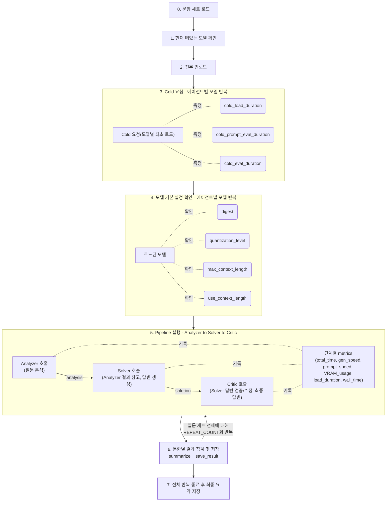

# 2026-09-18 TIL

## 오늘 한 것
- 프로젝트 README의 최종 정제 및 완성을 했다.
- 플로우차트/다이어그램들에 대한 최종 검토 및 확정을 진행했다.
- 팀 발표를 진행했다.
- 팀 발표에서는 클라우드 모델과 로컬 모델의 비교 결과에 대해서 발표를 담당했다.
- 여러 팀들과 얘기나누면서 피드백을 주고받았다.

## 왜 중요한가
- 발표도 중요한 과정 중 하나기 때문에 중요하다.

## 코드/예시

## 내일 더 파볼 것
- 휴식